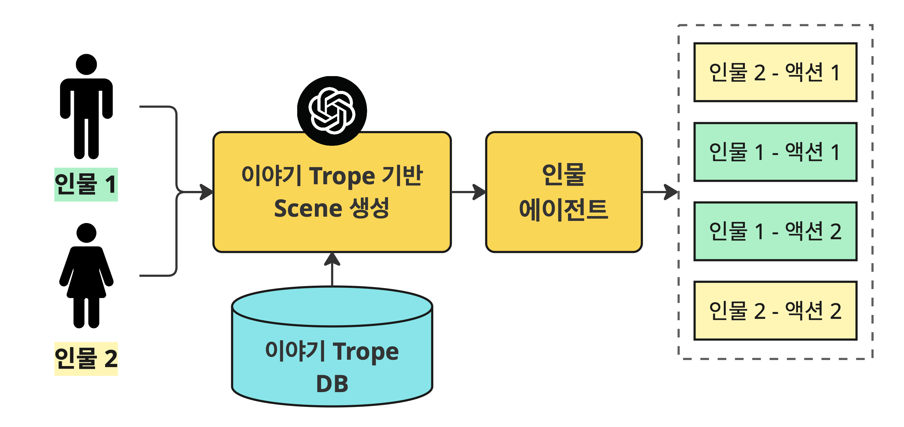
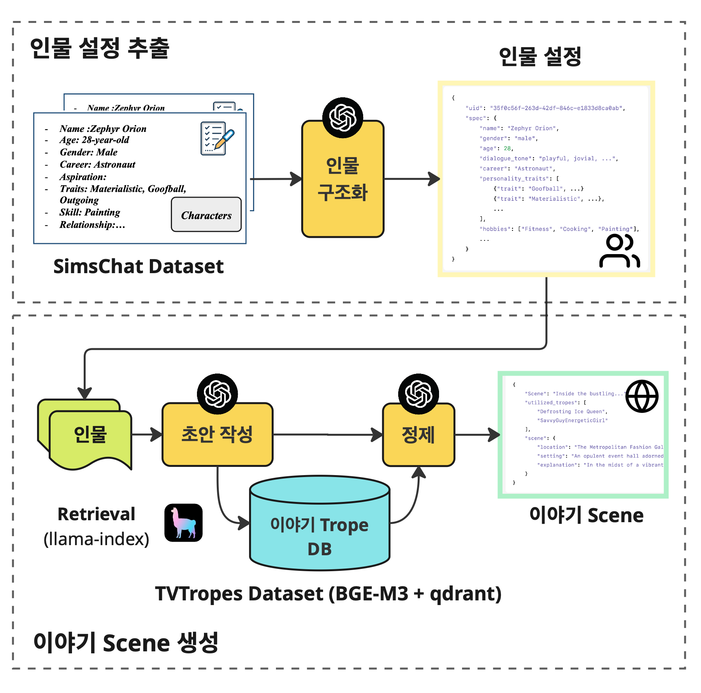
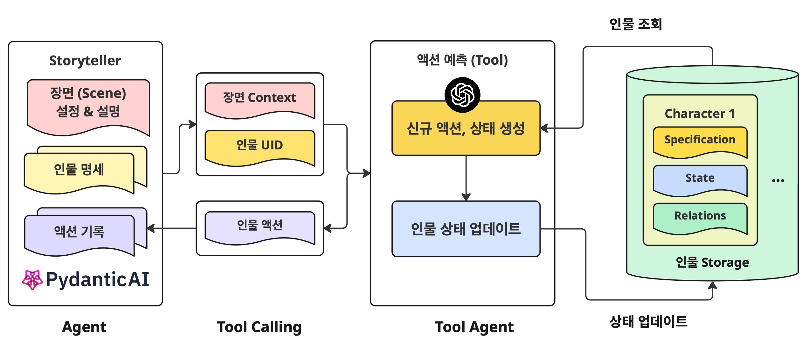

# story-trope-character-agent
Character agents that follows a story trope

## Overview


## 1. Prepare Data


### 1-1. Structurize SimsChat Characters

### 1-2. Index TVTropes dataset

## 2. Initialize Scene (Trope)
Initialize a story scene with 2 characters [[example notebook](./2_test_scene_initialization.ipynb)]
1. Write a Draft story trope
2. Retrieve relevant story-tropes from indexed TVTropes DB
3. Refine the Draft with retrieved tropes


```
# 1. Draft
'''
('Zephyr Orion, the outgoing and ambitious astronaut with a playful, jovial '
 'manner, loves to tell captivating tales of space adventures that make '
 'everyone around him feel at ease. Vivienne LaRoux, a sharp and assertive '
 'style influencer with a chic but occasionally dismissive attitude, often '
 'changes her opinions on fashion and lifestyle with a noncommittal air. In '
 'this small scene, Zephyr, eager to share his latest space story, quickly '
 "realizes that Vivienne's sharp wit and high standards don't easily lend "
 'themselves to his lighthearted storytelling, leading to a teasing exchange '
 'that reveals her dismissive side and his need to impress, creating a playful '
 'yet slightly tense dynamic.')
'''

# 2. Retrieve Tropes
>>>
* trope_id='t13173' name='LoonyFriendsImproveYourPersonality' explanation='A stiff character learns and grows...'
* trope_id='t16319' name='OracularUrchin' explanation="Usually female, small and fey in a disturbing way,...'
...

# Trope Refinement
{
    "revised_trope": "During a casual but lively social gathering ..",
    "utilized_reference_tropes": [
        "LoonyFriendsImproveYourPersonality"
    ],
    "scene": {
        "location": "Zephyr's city apartment",
        "setting": "A stylish, modern space filled with space memorabilia and art supplies, lit warmly to foster a relaxed, personal atmosphere.",
        "explanation": "In this scene, Zephyr, a playful and outgoing astronaut,...."
    }
}
```

## 3. Character Agent
